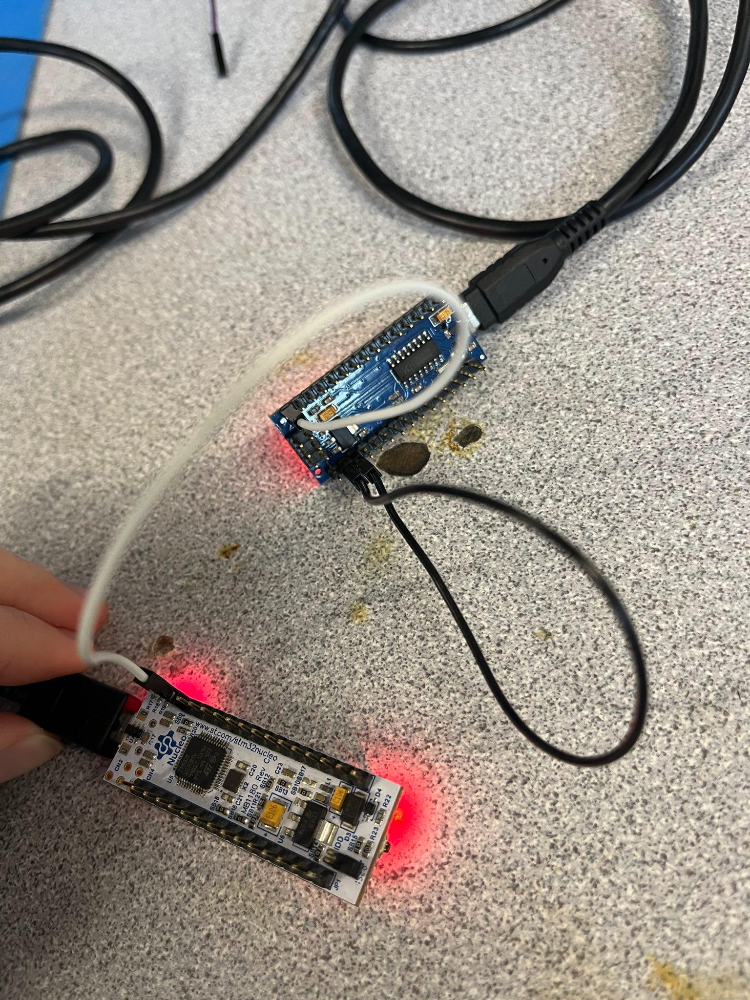
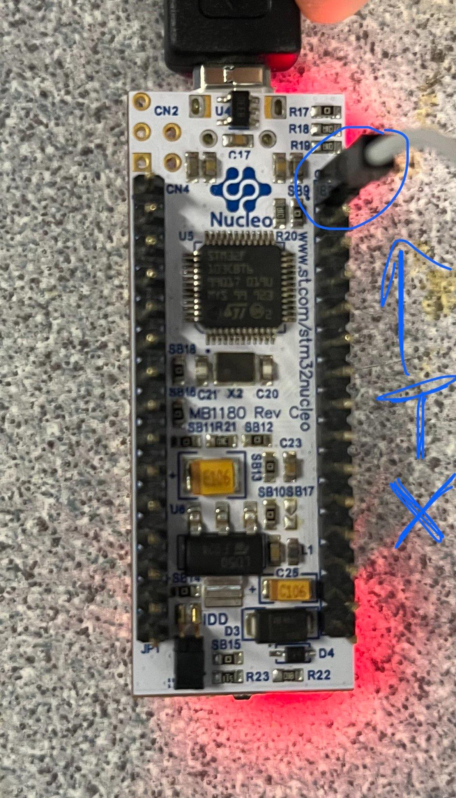
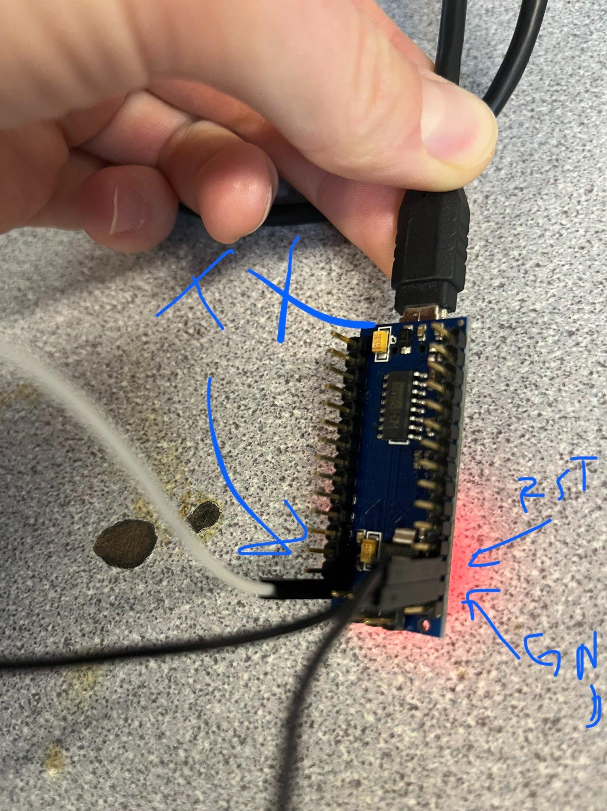
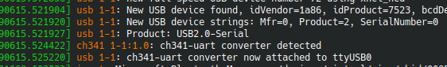
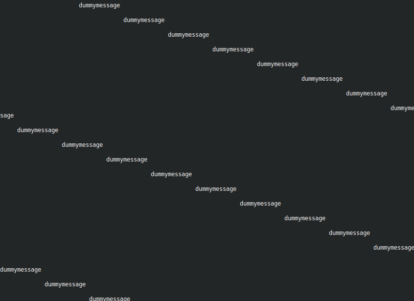
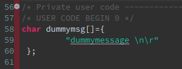
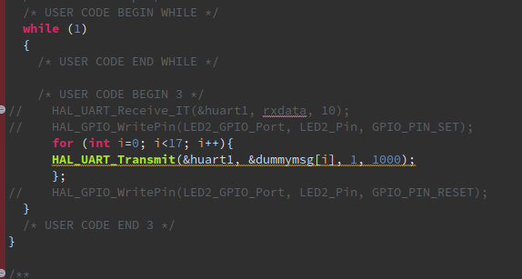

 # Dummy UART Device for Python GUI backend development 

 1. Install STM32CubeIDE. Link: https://www.st.com/en/development-tools/stm32cubeide.html 
 2. Import the project in this folder. (File-> import project from filesystem)
 3. Run the project on the board. 
 4. Wire the devices as shown below: 
 

# !!! IMPORTANT !!!: the Nano must be wired in Reset (RST connected to GND), and the Nucleo's TX pin must be connected to the TX pin of the Nano. Close up images below. NOTE THAT THE PINS ARE LABELLED ON BOTH BOARDS;; PLEASE CHECK BEFORE TURNING IT ON!

 5. Open a terminal (`ctrl-alt-t`)
 6. Run `sudo dmesg` to see the available devices. You will see something like this: 
 
 7. To set serial to 9600 baud, 8 bit data, no parity, 1 stop bit, run the command: `stty -F /dev/ttyUSB0 cs8 -cstopb -parenb`. If step 6 showed something other than USB0 (USB1, USB2, etc), replace `/dev/ttyUSB0` with `/dev/ttyUSBX` where X is the number shown in step 6. 
 8. Run the command `screen /dev/ttyUSB0 9600`
 9. You should see an output like the image below. 
 

 # To modify the dummymessage: 

 1. Open the project in STM32cubeIDE. 
 2. Navigate to the main.c: `dummyf031RE/dummyf031/Core/Src`

3. Change the message in line 59 below: 

4. Change the message length in the infinite while as shown below: 

5. Verify the code compiles and you can see the data on the USB interface. 