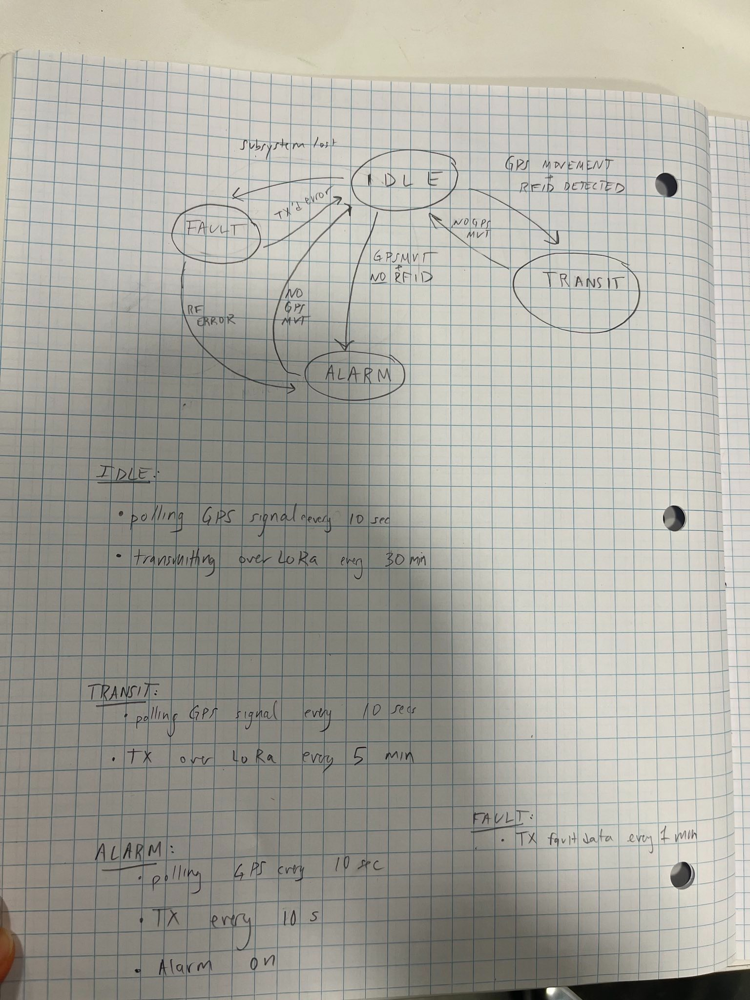

# 2-8-22 Tues [Elizabeth]
## Group and TA meeting

### Agenda: 

- discussed part selection
- began block diagram and proposal 

### Action Items: 

Elizabeth: 
- finish block diagram 
- write subsystem spec and reqs for Microcontroller/LoRa and Alarm 
- subsystem block diagram for microcontroller/LoRa and alarm 

Nidhi: 
- Finish writing main proposal sections
- GPS Module: Write proposal subsystem section

Alex:
- RFID Module and RFID tag: Write proposal subsystem section 
- Write ethics and safety

GOAL: finish these tasks by midnight wednesday, so we can all review the proposal in full and submit on Thursday

# 2-9-22 Individual work notes [Elizabeth]

## Task List by subsystem

### Overall
- CAD/3d printing model for bike unit 
- design main board(s)

### Alarm 
- design alarm PCB (piezo button, driver circuit, power)

### GPS module 

- read datasheet, identify communication protocol 
- design support circuitry

### RFID subsystem 

- read datasheet and understand communication interface
- design support circuitry

### Microcontroller/LoRa

- choose pinout based on serial data requirements
- design support circuitry
- write firmware 

### Reciever 

- research how to write a python backend for the data display GUI
- research how to implement a LoRa mesh network 

# 2/16/22 Design Document Planning Meeting [Elizabeth]

## Agenda: 
- Sketched HW block diagram (physical configuration)
- Sketched firmware state machine
- Discussed division of labor 
- 
## Physical configuration block diagram: 

## State diagram: 

## Hardware tasks: 

- Design main board 
   - RF section: E, N
   - Power section: A
   - MCU support, connectors, etc: E

- Design Alarm driver board: A 
- Design RFID carrier board: N 

## Goal: 

Finish schematic design tasks by evening Saturday

