# 2-8-22 Tues [Elizabeth]
## Group and TA meeting

### Agenda: 

- discussed part selection
- began block diagram and proposal 

### Action Items: 

Elizabeth: 
- finish block diagram 
- write subsystem spec and reqs for Microcontroller/LoRa and Alarm 
- subsystem block diagram for microcontroller/LoRa and alarm 

Nidhi: 
- Finish writing main proposal sections
- GPS Module: Write proposal subsystem section

Alex:
- RFID Module and RFID tag: Write proposal subsystem section 
- Write ethics and safety

GOAL: finish these tasks by midnight wednesday, so we can all review the proposal in full and submit on Thursday

# 2-9-22 Individual work notes [Elizabeth]

## Task List by subsystem

### Overall
- CAD/3d printing model for bike unit 
- design main board(s)

### Alarm 
- design alarm PCB (piezo button, driver circuit, power)

### GPS module 

- read datasheet, identify communication protocol 
- design support circuitry

### RFID subsystem 

- read datasheet and understand communication interface
- design support circuitry

### Microcontroller/LoRa

- choose pinout based on serial data requirements
- design support circuitry
- write firmware 

### Reciever 

- research how to write a python backend for the data display GUI
- research how to implement a LoRa mesh network 

# 2/16/22 Design Document Planning Meeting [Elizabeth]

## Agenda: 
- Sketched HW block diagram (physical configuration)
- Sketched firmware state machine
- Discussed division of labor 
- 
## Physical configuration block diagram: 

## State diagram: 

## Hardware tasks: 

- Design main board 
   - RF section: E, N
   - Power section: A
   - MCU support, connectors, etc: E

- Design Alarm driver board: A 
- Design RFID carrier board: N 

## Goal: 

Finish schematic design tasks by evening Saturday

# 3/6/2022 Group PCB Work 

- Each working on finishing PCB layout by Tues deadline
- Alex finished the alarm board, nidhi finished RFID carrier board
- Alex finished alarm BOM, Nidhi finished RFID BOM
- Elizabeth working on main board

# 4/2/2022 Hardware work 

-- Elizabeth: working on running LoRa example application on STM32WL dev board. Pinout and instructions below. 

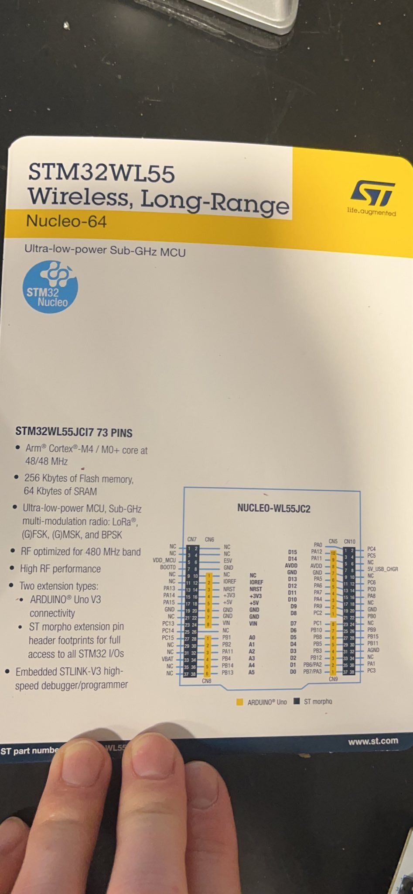

Trying to run the LoRa demo on the board -- following directions below from UM2463 for STM32cubeide. First the blinky example (GPIO_EXTI), then one of the LoRa ones -- File path to LoRa project is `bike-anti-theft-device/Firmware/stm32wl_fwpackage/STM32Cube_FW_WL_V1.2.0/Projects/NUCLEO-WL55JC/Demonstrations/LocalNetwork/`. Running the "sensor" first -- setup is connected to Spectrum analyzer, want to verify that it can transmit something. 

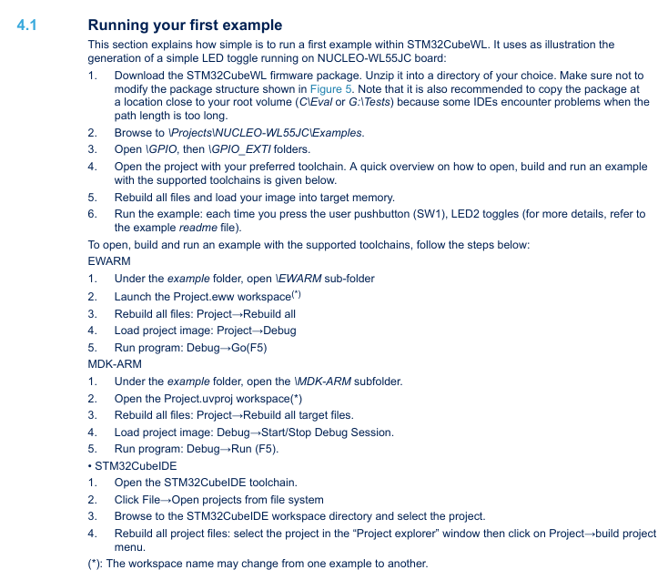

NOTE: use IMPORT-> Import STM32CubeExample and then select the desired example. Otherwise it will not load builders and the project won't build (and I couldn't figure out how to add builders after the project has already been imported).

Blinky worked! Now onto trying a LoRa example. Note that the LoRa examples require STM32CubeIDE 1.9+ apparently. 

Back to the AT slave example...ugh. UART on linux: 

screen /dev/ttyACM0 9600

monitor serial: `cat -v /dev/ttyACM0`

send command: `echo -e 'command' > /dev/ttyACM0`

set serial to 9600 baud, 8 bit data, no parity, 1 stop bit: `stty -F /dev/ttyACM0 cs8 -cstopb -parenb`

Successfully ran RF test at 400-500 MHz. Next time, populate board, work on porting LoRa example to our HW. 

# 4/6/2022 -- More firmware (Elizabeth)

Upgraded BMP debugger to latest firmware which supports STM32WLs. Note that the latest version of arm-none-eabi-gdb is borked on linux, so you need to run v10.3. Source at https://developer.arm.com/tools-and-software/open-source-software/developer-tools/gnu-toolchain/gnu-rm/downloads. 

## Goal today: talk to GPS over UART. 

- reconfigured the STM32 pinout.. whoops. 
- Testing just UART peripheral. Using single core to allow use of a Makefile (not supported by CubeMx for dual-core)

- NOTE: pinout given in EM-506 datasheet is pinout looking IN to the GPS module board (pin 1 on the RH side; grey wire is pin 6.)

First try didn't work. Probed with scope; GPS module clearly sending some data, it is just not being received by the STM32. Next step: try "loop" UART (ie, send from STM32 TX pin -> STM32 RX pin) to make sure I'm implementing the peripheral correctly.

Tutorial for loopback test: 
https://stackoverflow.com/questions/43263467/nucleo-stm32f103rb-f4-discovery/43411114#43411114

https://stackoverflow.com/questions/47574416/uart-loopback-test-using-hal-for-stm32l0

Loopback test code: 

    MX_GPIO_Init();

      MX_USART1_UART_Init();

      // MX_LoRaWAN_Init();

      /* USER CODE BEGIN 2 */

      uint8_t txdata[2] = {0xEC, 0xEB};

      uint8_t rxdata[2] = {0,0};

      /* USER CODE END 2 */

      /* Infinite loop */
      /* USER CODE BEGIN WHILE */
      while (1)

      {

        HAL_UART_Receive_IT(&huart1, rxdata, 2);

        HAL_UART_Transmit(&huart1, txdata, 2, 10);

        /* USER CODE END WHILE */

        // MX_LoRaWAN_Process();

        /* USER CODE BEGIN 3 */
      }

The default communication parameters for PORT B are 9600Baud, 8data bits, 0 stop bits, and no
parity.

EM-506 can be configured to use NMEA messages: 

https://en.wikipedia.org/wiki/NMEA_0183

Ugh. Verified *manually* via oscilloscope that the UART messages have no stop bit -- this means they are *actually* impossible to use, since stty and STM32s do not support UART with no stop bit. 

# 4/10/2022 Second try- new GPS module

Adafruit Ultimate GPS breakout v3

https://learn.adafruit.com/adafruit-ultimate-gps/direct-computer-wiring

Ok, clearly, all of these GPS modules are "meant" to be used with arduino, and all of the arduino serial libraries don't let you specify uart parameters like stop bit, word length and parity... so none of the documentation for the modules specify uart parameters and I can't figure out what the arduino serial libraries are assuming. Goal: figure out default Arduino UART config. 

https://www.engineersgarage.com/articles-arduino-serial-communication-uart/

Default Arduino UART config (`SoftwareSerial.begin()`) is 8N1 (8 bit word, no parity, 1 stop bit.)

Ok, so now it gets the first character ($) and nothing else. Thinking maybe the clock is off since there is no external oscillator... trying STM32 auto baud rate to see if that helps. 

auto baud rate did not help. RIP. 

Going back to the terminal with the IDP . RX LED flashing, clearly the module is sending *something*... but cannot recieve it with Screen. 

Scoped the UART trace. Apparently UART idles low??? bizarre. Trying to invert the polarity w cubeMX next. Does look like 9600 baud tho. 

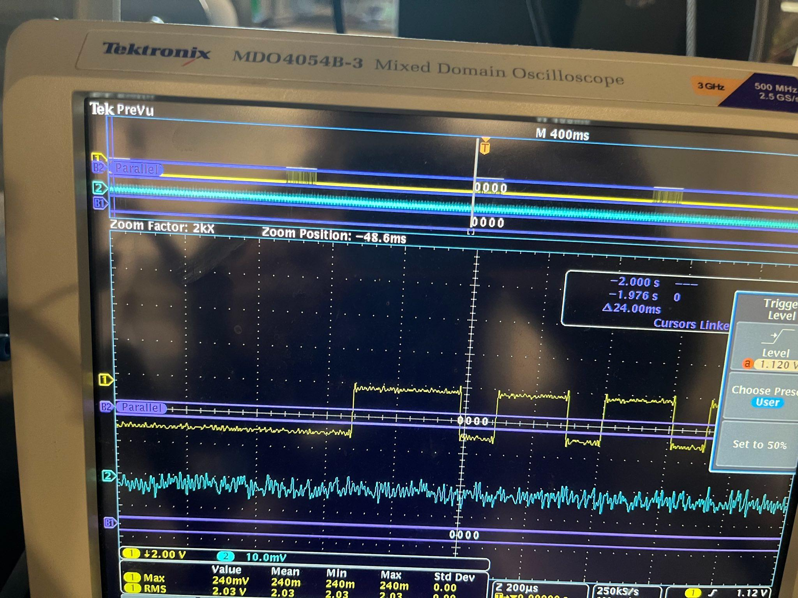

Decoding binary by hand :cry: .. clearly inverted with 1 start bit, 1 stop bit, 8 bits of data tho
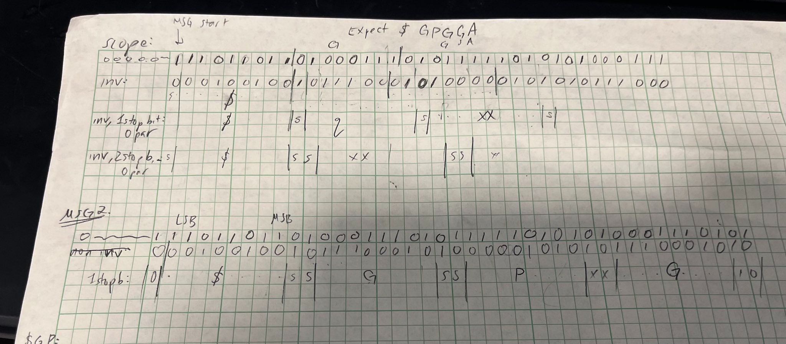

ugh. strategy.... do a loopback test while probing the UART from TX/RX on the STM32. adjust settings until it matches the waveform from the GPS module. 

With both TX and RX invert, no Data invert: idles high

only TX invert: also idles high, received data is wrong as to be expected

ok, data invert + software NOT-ing the data reproduces the waveform. Problem: the STM32 still can't rx data from the GPS. 

Loopback: 

Hi: 3.16 V
Lo: -40mV
Period: 108 uS
Idle high
bits: 0 00100100 10 11100010 10 00001010 10

GPS: 

Hi: 3.24 V
Lo: -120 mV 
Period: 108 uS
Idle HIGH 
same bits 
AGHH!!!

Tried with arduino -- works fine. Bizarre. Thought: timing might be *slightly* off, and Arduino is fine with it bc it has a lower clock speed, but the STM32 is pickier. Next step: fiddle with STM32 UART oversampling rate and/or baud rate to see if that fixes it. 

# 4/11/2022 More Debugging -- Elizabeth 

Switched to SWO instead of JTAG in CubeMx.. probably not going to help but worth a try. 

Try: 
-audo baud rate on falling edge + single sample

Ok, abandoning UART for now. Current plan... use Arduino as intermediary between GPS and STM32, hardware serial with level-shifter since the arduino uses 5V logic. 

# 4/11/2022 Late night -- LoRa Work

Now onto the actually difficult part... getting them to talk to each other. Unfortunately the osc screwup is mostly un-bodgeable, so we are relying on the internal oscillator for now. Not great but oh well. 

## Notes about LoRa application structure: 

reference: 
https://www.st.com/content/ccc/resource/technical/document/application_note/group1/de/e1/90/fd/84/e3/49/bd/DM00660451/files/DM00660451.pdf/jcr:content/translations/en.DM00660451.pdf

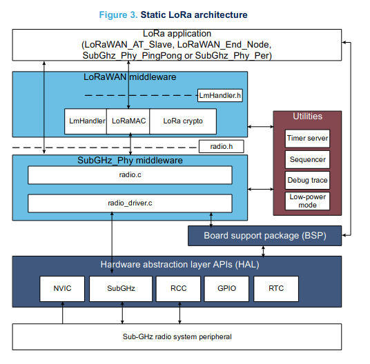

This is the LoRA application structure for all of the example applications. To write a custom application, you can write your own application on top of just the LoRaWAN middleware. 

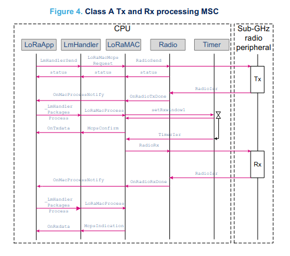

This shows the sequence of RX/TX processing 

State machine: 

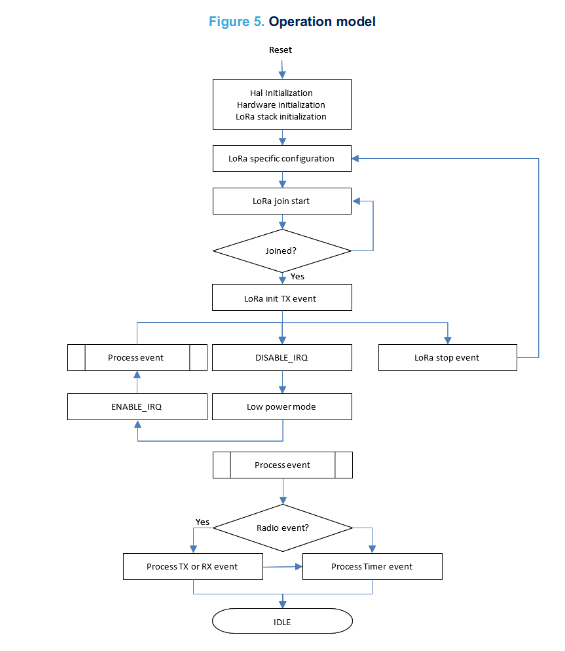

tracing this through the code for LoRaWAN_AT_Slave: 

1. in infinite while loop, MX calls `MX_LoRaWAN_Process()`

- - in `MX_LoRaWAN_Process()`, AT_slave calls the sequencer

2. In init code, MX generates `LoRaWAN_Init()` and `SystemApp_Init()`;

3. `LoRaWAN_INIT()` calls `LmHandlerInit(&LmHandlerCallbacks)`, initializing the LoRa State machine
 - - In the user code sections here, the user must place their own app initialization code. 

 Commands: 

 commands for the AT_slave application are in `lora_at.c` and `lora_command.c`. 

 The two basic commands for *just* sending data and joining a network:

 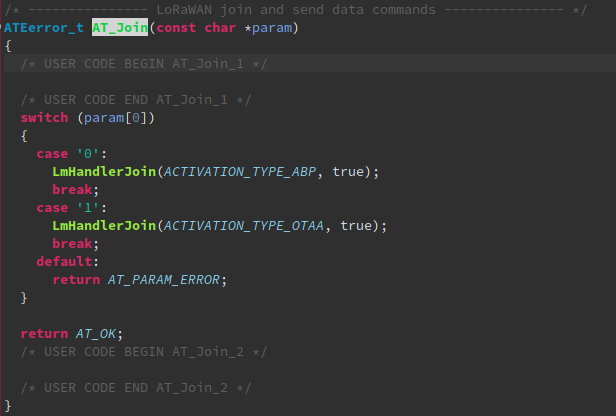

    ATEerror_t AT_Send(const char *param)
    {
      /* USER CODE BEGIN AT_Send_1 */

      /* USER CODE END AT_Send_1 */
      const char *buf = param;
      uint16_t bufSize = strlen(param);
      uint32_t appPort;
      LmHandlerMsgTypes_t isTxConfirmed;
      unsigned size = 0;
      char hex[3] = {0, 0, 0};
      LmHandlerErrorStatus_t lmhStatus = LORAMAC_HANDLER_ERROR;
      ATEerror_t status = AT_ERROR;

      /* read and set the application port */
      if (1 != tiny_sscanf(buf, "%u:", &appPort))
      {
        AT_PRINTF("AT+SEND without the application port\r\n");
        return AT_PARAM_ERROR;
      }

      /* skip the application port */
      while (('0' <= buf[0]) && (buf[0] <= '9') && bufSize > 1)
      {
        buf ++;
        bufSize --;
      };

      if ((bufSize == 0) || (':' != buf[0]))
      {
        AT_PRINTF("AT+SEND missing : character after app port\r\n");
        return AT_PARAM_ERROR;
      }
      else
      {
        /* skip the char ':' */
        buf ++;
        bufSize --;
      }

      switch (buf[0])
      {
        case '0':
          isTxConfirmed = LORAMAC_HANDLER_UNCONFIRMED_MSG;
          break;
        case '1':
          isTxConfirmed = LORAMAC_HANDLER_CONFIRMED_MSG;
          break;
        default:
          AT_PRINTF("AT+SEND without the acknowledge flag\r\n");
          return AT_PARAM_ERROR;
      }

      if (bufSize > 0)
      {
        /* skip the acknowledge flag */
        buf ++;
        bufSize --;
      }

      if ((bufSize == 0) || (':' != buf[0]))
      {
        AT_PRINTF("AT+SEND missing : character after ack flag\r\n");
        return AT_PARAM_ERROR;
      }
      else
      {
        /* skip the char ':' */
        buf ++;
        bufSize --;
      }

      while ((size < LORAWAN_APP_DATA_BUFFER_MAX_SIZE) && (bufSize > 1))
      {
        hex[0] = buf[size * 2];
        hex[1] = buf[size * 2 + 1];
        if (tiny_sscanf(hex, "%hhx", &AppData.Buffer[size]) != 1)
        {
          return AT_PARAM_ERROR;
        }
        size++;
        bufSize -= 2;
      }
      if (bufSize != 0)
      {
        return AT_PARAM_ERROR;
      }

      AppData.BufferSize = size;
      AppData.Port = appPort;

      lmhStatus = LmHandlerSend(&AppData, isTxConfirmed, false);

      switch (lmhStatus)
      {
        case LORAMAC_HANDLER_SUCCESS:
          status = AT_OK;
          break;
        case LORAMAC_HANDLER_BUSY_ERROR:
        case LORAMAC_HANDLER_COMPLIANCE_RUNNING:
          status = (LmHandlerJoinStatus() != LORAMAC_HANDLER_SET) ? AT_NO_NET_JOINED : AT_BUSY_ERROR;
          break;
        case LORAMAC_HANDLER_NO_NETWORK_JOINED:
          status = AT_NO_NET_JOINED;
          break;
        case LORAMAC_HANDLER_DUTYCYCLE_RESTRICTED:
          status = AT_DUTYCYCLE_RESTRICTED;
          break;
        case LORAMAC_HANDLER_CRYPTO_ERROR:
          status = AT_CRYPTO_ERROR;
          break;
        case LORAMAC_HANDLER_ERROR:
        default:
          status = AT_ERROR;
          break;
      }

      return status;
      /* USER CODE BEGIN AT_Send_2 */

      /* USER CODE END AT_Send_2 */
    }

  

Note that the above function basically just manages the LmHandler. Note also that `*param` is a pointer to a string that *contains* the parameters .. very helpfully not explained at all in the code. From [AN5481, 'LoRaWAN AT Commands for STM32CubeWL](https://www.st.com/content/ccc/resource/technical/document/application_note/group1/63/ee/3a/53/c3/49/46/c1/DM00699239/files/DM00699239.pdf/jcr:content/translations/en.DM00699239.pdf): 

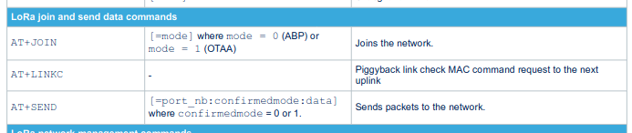

## Tentative path forward: 

0. Fix linker file. Use template if possible.

1. Import basically the entire AT application source code into the user-defined MX skeleton (likely easier said than done... )

2. Remove sequencer initialization, etc, from init and setup code. Also attempt to remove serial writes (AT_PRINTF) or disable interface entirely. 

3. VERIFY RF SWITCH CONNECTIONS

4. Write test program that explicitly calls RF tests at the LoRa frequency; DO NOT FORGET RF SWITCH EXPLICIT CONTROL

4. Write test program that explicitly calls AT_Send with dummy data to see if we can send something 

5. Proceed with state machine implementation using explicit AT commands. 

# 4/12/2022 More LoRa brainstorming

After more thought, it might actually be better to go a few more layers down in the protocol and avoid the LoRa MAC entirely. Also because I don't want to deal with making a WAN. The MAC is just me uhhh... having one TX unit and one RX unit. 

https://forum.digikey.com/t/using-the-low-level-sub-ghz-radio-driver-for-the-stm32wl-series/18253

Ok, regenerated firmware in SubGHz firmware with just SubGHz_PHY enabled. radio_driver.c looks like it has the low-level functions to directly control the radio (literally just reading/writing registers in the hardware). 

-> try and check LoRa examples for sequency of SGHZ commands, but looks like you can pretty directly just set TX params, set packet params, and go ahead and send stuff. for example `SUBGRF_SetPacketParams ` lets you just set the packet type as LoRA. 

# 4/13/2022 Elizabeth -- Writing radio setup and test programs 

ok, radio_driver.c is actually the lowest-level radio driver. radio.c is the high-level direct radio driver for the STM32WL which is easier to use. In `bt_radio.c`, getting started writing actual functions for our radio. 

- `btLoRaSetup`: setting rx and tx configs

- `btLoRaListen(timeout)`: listens for a set period of time before timing out

- `btLoRaTx(uint8_t *data, uint8_t datasize)`; Sends a packet of data over the LoRa link 

The reference manual [RF0453](https://www.st.com/en/microcontrollers-microprocessors/stm32wl-series.html#documentation) gives some useful information about LoRa modulation parametes (p.161): 

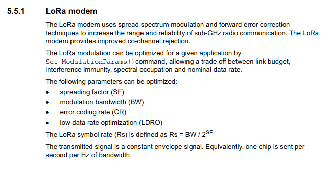

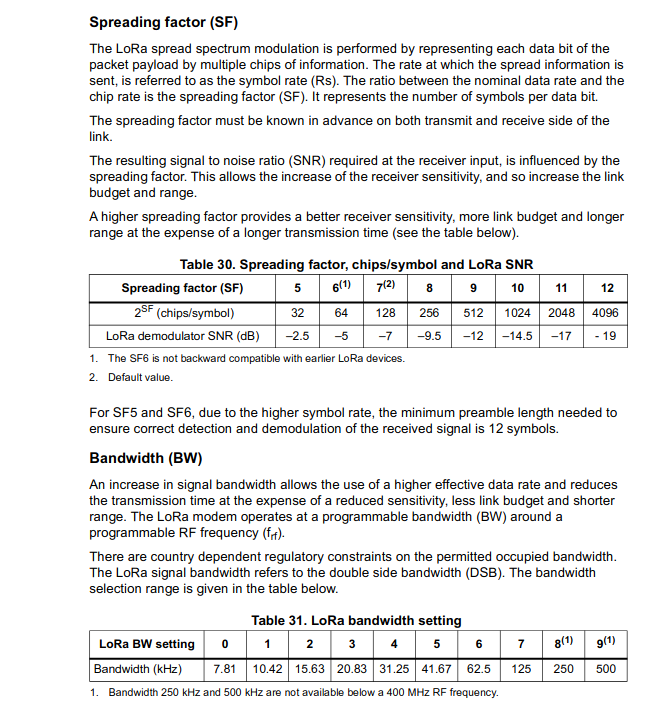

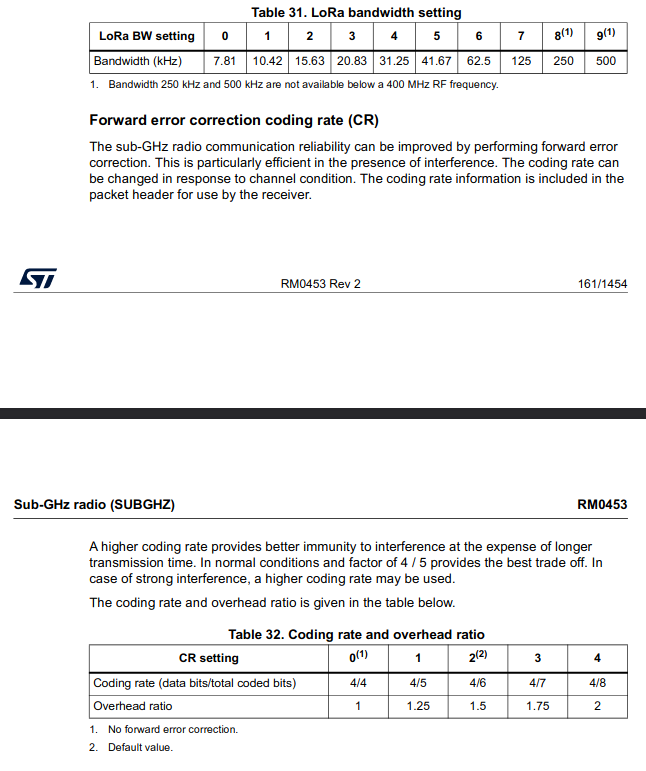

--> basically all params set to the most "conservative" option/easiest to implement (ie, highest spreading factor, disable frequency hopping, disable CRC). 

The way you're "supposed" to interact with the radio is through callbacks -- the HAL provides weakly-defined callback functions for things like "preamble detected," etc. then you redefine them to do what you want. Thought -- define a volatile RX buffer, continuously read data into it on a RX callback, then output desired data the pointer to a buffer for the specific function. 

Ok, read more docs, looks like you can just access the SUBGHZ rx buffer with a read operation. New plan: in the RX callback, read the databuffer.

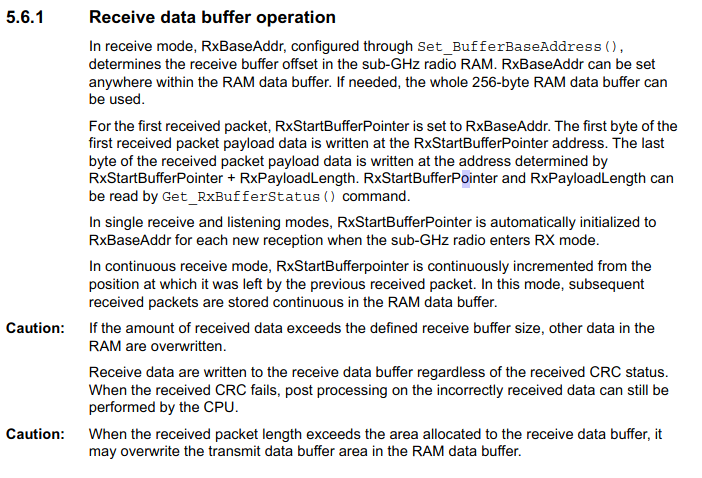

# 4/16/2022 Elizabeth - Attempting TX/RX 

- https://www.3glteinfo.com/lora/lorawan-frequency-bands/

- https://www.rfwireless-world.com/Tutorials/LoRa-frequency-bands.html

LoRa channel info ^ 

Added channel select into `btLoRaSetup()` (904.6 MHz = 904 600 000)

ugh. keep getting BMP (debugger) errors. Tried depopulating C8 as a hail mary... 0.1u cap might be too much for a short reset pulse. Maybe. 

Depopulating C8 did not help. Intermittent BMP errors keep happening but occasionally go away, so I'm ignoring that for now I guess. 

Attempted TX (`Radio.TxCw(len)`)..... no output on spectrum analyzer. Attempting to debug.... 

rudimentary check with scope (literally probed the microstrip trace) shows *something* before the RF switch, nothing afterwards... another hail mary but tried depopulating the RF switch?

Ok, pretty sure that was unnecessary and I'm just an idiot, I forgot to include the GPIO set/reset to set the rf switch properly. Oh well. hopefully the bodge is relatively fine since it's 900 MHz and the bodge is like 2 mm. 

found the culprit, or at least part of it: 

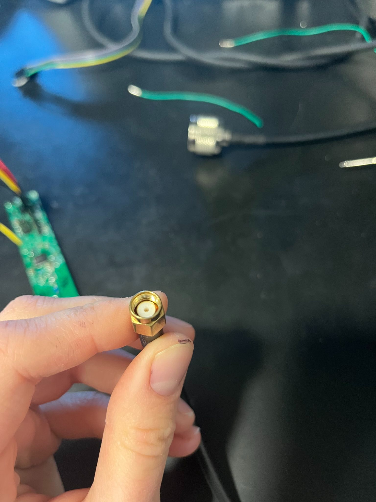

Which means I just spent 5 hours debugging a broken SMA connector and probably fried the STM32 because it was transmitting 17 dBm into a hard open. Great. 

# 4/17/22 Elizabeth - Still More Radio Debugging

Trying again to see if I can transmit with the spectrum analyzer. 

First: grabbed STLINK debugger from 395 to try and do a full hard reset to solve the swdp_scan/vFlashErase errors. This unfortunately involved booting into windows and updating the firmware on the stlink to support STM32WLs, but it did seem to solve the issue. 

omg... I forgot to power the PA LMFAO. 

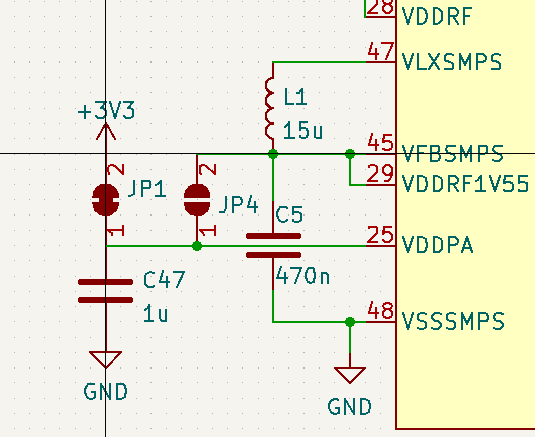

JP1 supplies power to the RFO_HP pin (high-power PA), I left them as jumpers in case i wanted to use the SMPS but never soldered JP1. Time to try that and see if powering the PA helps it transmit. 

Ok, still doesn't work. Looking at the datasheet to check if there could be a clock issue. 

Ok, seems like the SubGHz radio actually *always* requires the HSE, regardless of whether or not it is initialized in firmware. 

Goal: somehow get a 32 MHz clock onto the OSC_IN pin because the radio apparently autonomously turns on the HSE and presumably doesn't work if there is no HSE. 

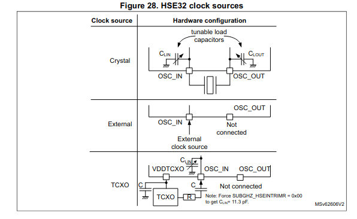

Attempting to bludgeon the STM32 into using it's own internal clock -- route MSI (medium-speed internal) onto Master clock output (MCO) pin, wire that to the OSC_IN external source. 

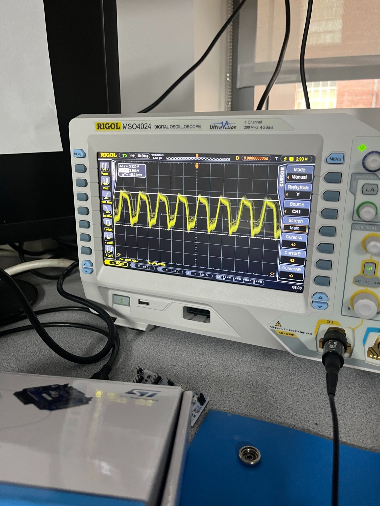

First try had weird clock with DC offset... seems the GPIO must be explicitly set to "fast" for the output here. It does look like 32 MHz tho which is promising. Setting that, regenerating and flashing again. 

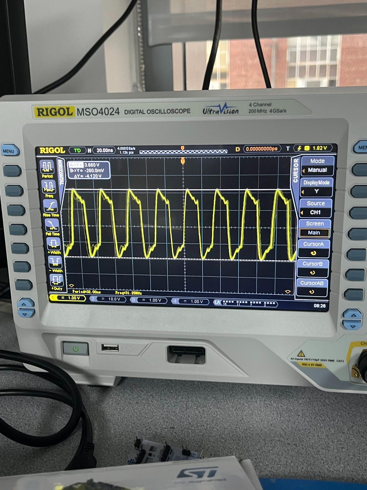

Success -- relatively normal-looking clock waveform. It does go up to about 3.8V.... presumably an inductive spike somewhere (probably my badly routed long trace). absolute max voltage is 3.9/-0.3 on all pins so hopefully it's fine. Trying to transmit again.

No dice. Yay. Trying to use the low-level driver now. Attempting to just set to CW (RFSW select commented out bc I'm using the bodged board with no RF switch): 

    while (1)
      {
        /* USER CODE END WHILE */
        MX_SubGHz_Phy_Process();

        /* USER CODE BEGIN 3 */
      //  HAL_GPIO_WritePin(RFSW_VC1_GPIO_Port, RFSW_VC1_Pin, GPIO_PIN_RESET);
      //  HAL_GPIO_WritePin(RFSW_VC2_GPIO_Port, RFSW_VC2_Pin, GPIO_PIN_SET);
        SUBGRF_SetRfFrequency(904600000);
        SUBGRF_SetRfTxPower(17);
        SUBGRF_SetTxContinuousWave();
        radio_state = SUBGRF_GetStatus();
        radio_errors = SUBGRF_GetDeviceErrors();

      }
      /* USER CODE END 3 */
    }

  And also hopefully get any errors (struct below): 

  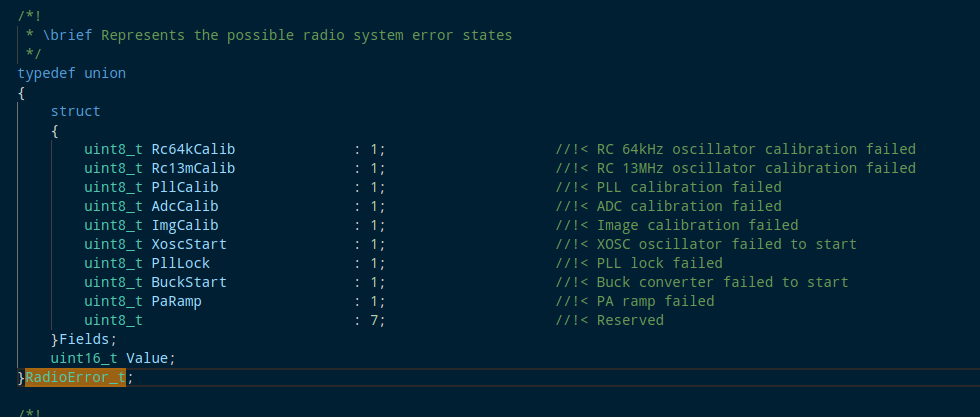

GDB results below (radio_state and radio_error were queried right after attempting to run `SUBGRF_SetTxContinuousWave()` as shown above):

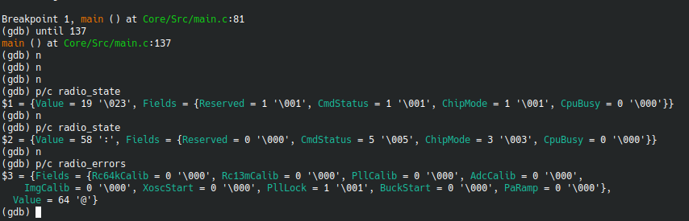

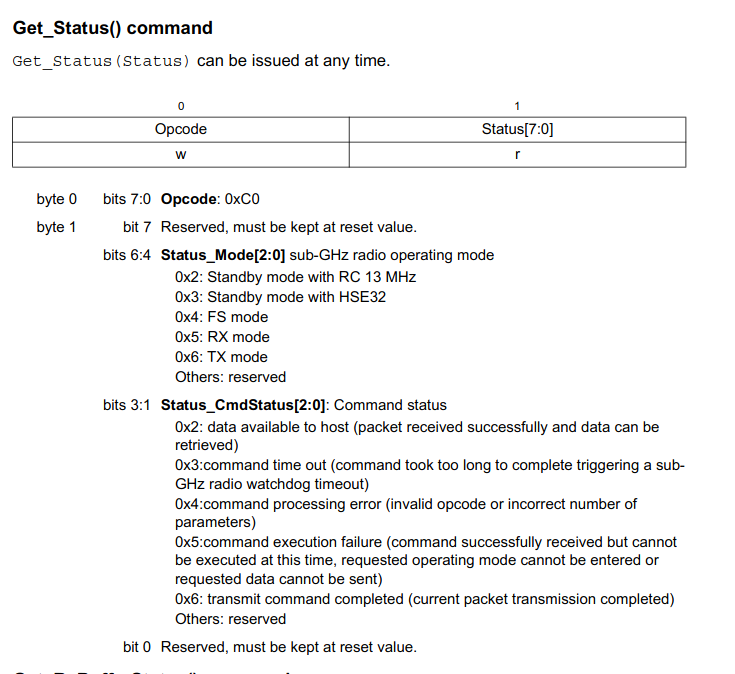

Ok, honestly this is not surprising, but at least it's a solid answer -- radio is in HSE32 standby mode, command execution failure. Presumably the failure was because the PLL cannot lock. Ordered a couple 32 MHz crystals (and appropriate load caps) on Digikey to try and see if I can solder them onto the pads and fix the issue. 

# 4/18/2022 Elizabeth -- Back to UART

The radio issue is pretty much an unsolvable problem at this point ... we will wait for the oscillators to come in and then try again. In the mean time, decided to take another look at the UART peripherals (GPS and RFID). RFID antenna also came in today, so hopefully I can use that. 

New approach -- try and get GPS uart working on the dev board. Hopefully this will prevent issues with the debugger from derailing my progress for hours again. 

## Test 1 -- Nucleo USART1

- USART1_TX: PB6
- USART1_RX: PB7

+5V/GND connected to +5V/GND on the board. Setup below: 

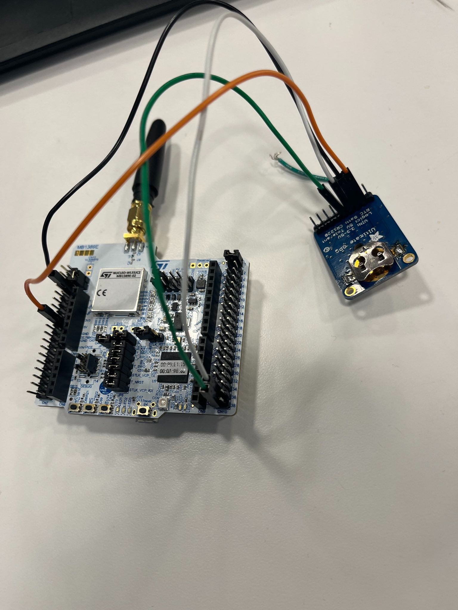

No dice... unsurprising. 

Sanity checking with a loopback test again. Setup below (both LPUART1 and USART1, since both the RFID and the GPS will need it eventually): 

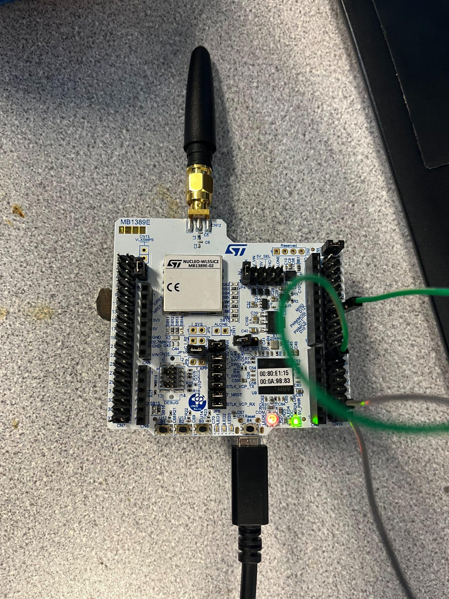

Ok, I just forgot to enable the interupt, but after doing that it was fine. Now, trying with the GPS module again... no dice. 

Next step: seeing if a minor frequency error could be causing the problem. 

Using the logic analyzer to get the exact pulse length: almost exactly 104 uS, which corresponds to a frequency of 9615 baud. 

Attempting to sweep the baud rate: 

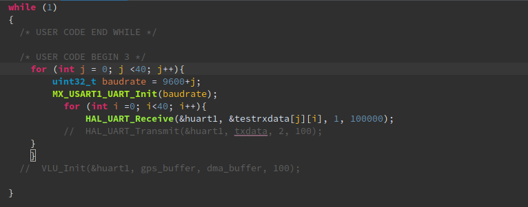

(redefined uart init as below, re-initialized to switch baud rate each time)
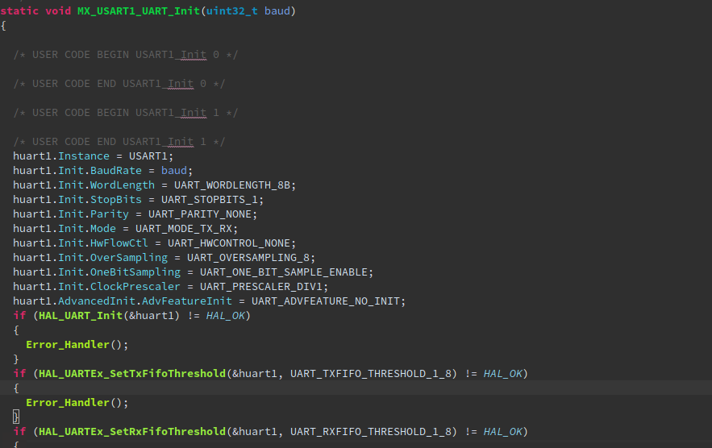

This kinda worked, and now it seems like just receiving 1 byte at a time usually works. 

Now, trying to query the GPGGA message, and immediately receive after that. 

Code: 

    // query the GGA message from the GPS.
      char queryGGA[]= "$PSRF103,00,01,10,00,\r\n";

    HAL_UART_Transmit(&huart1, (uint8_t *)queryGGA, 25, 100);
      for (int i =0; i<90; i++){
        HAL_UART_Receive(&huart1, &testrxdata[i], 1, 1000);
          //	HAL_UART_Transmit(&huart1, txdata, 2, 100);
        }

Result: 
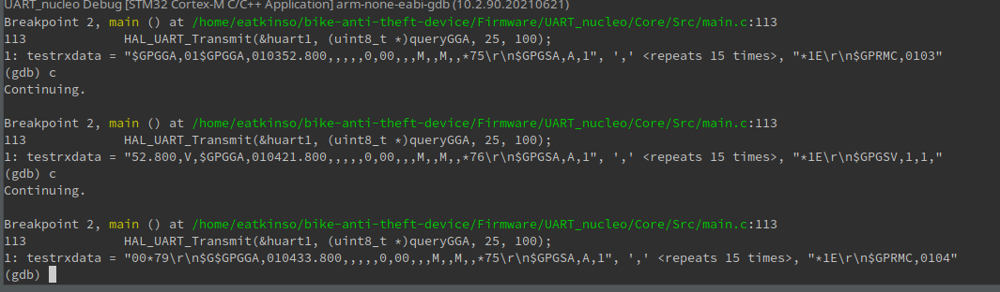

so this basically looks like there's garbage on either side, but it consistently receives the data in the middle. 

Ok, we now have GPS data: btgps.c has the gps parser, just committed it at commit hash `cca477bb`. 
struct below shows the fields and the data.. currently just a meaningless UTC time but that's because I'm inside right now so I can't get a lock. 
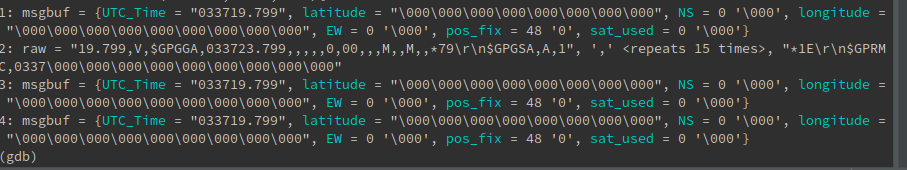
Tested outside and the GPS does lock! Results below: (this was at 9:18 PM)
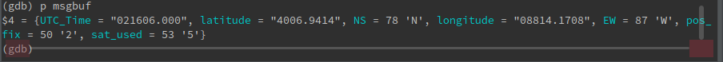

# 4/19/2022 Elizabeth -- Writing State Machine

Now, writing the state machine. See diagram below. 
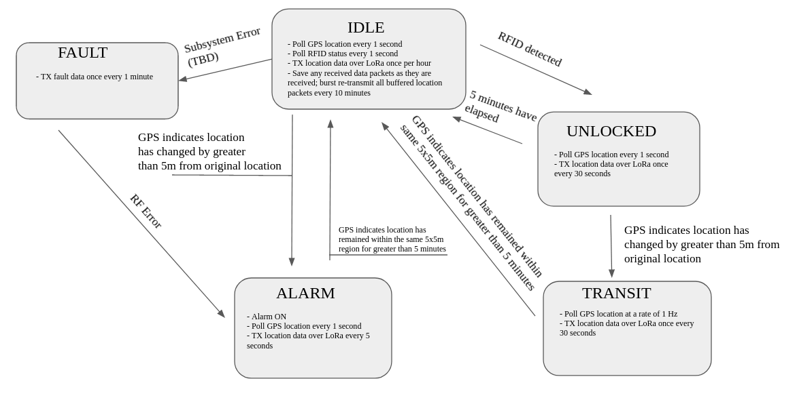

    typedef enum states{
      IDLE,
      UNLOCKED,
      TRANSIT,
      ALARM,
      FAULT
    } statemachine_state_t;

# 4/21/2022 (Elizabeth) USB/Serial Hacky Stupidity

Ok, I'm mega-stupid and forgot to buy the FTDI I2C-Serial chip we need for one of the boards. So we need to find some idiotic way to convert USB-serial for Alex's GUI to work. Current plan: using the CH340 chip on the elegoo arduino nanos I have as an intermediary. 

First: UART dummy code on the STM32 nucleo board. Using a normal Arduino as the usb/serial intermediary to verify that it works there. Wiring diagram below (shown for pic16 -- for nucleo, just wire TX->TX and RX->RX. No need to connect 5V since the arduino is already powered through USB.). 

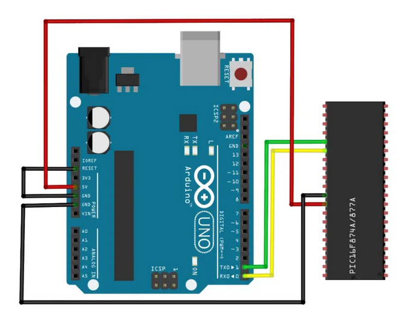

IMPORTANT!!!!!!!!!!: ARDUINO LOGIC IS 5V

ok, got my arduino nano is working as a USB/Serial converter. Setup below (GPS module used as the generic UART device) -- simply connect RST->GND, TX/TX, power the device from the arduino.)

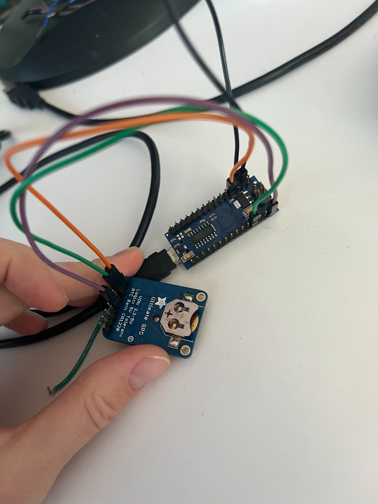